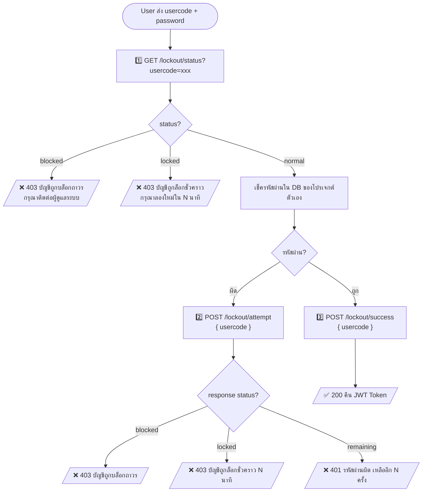
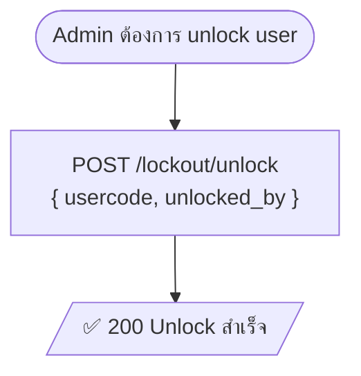

# คู่มือการเชื่อมต่อ csc-unlock-user-api

## ข้อมูลเบื้องต้น

| รายการ | ค่า |
|---|---|
| Base URL | `http://192.168.1.x:7011` |
| Auth Header | `x-admin-key: <ADMIN_SECRET>` |
| Content-Type | `application/json` |

> ขอ `ADMIN_SECRET` จากผู้ดูแลระบบ — ห้าม hardcode ใน code ให้เก็บใน `.env`

---

## Endpoints ทั้งหมด

| Method | Path | ใช้ทำอะไร | ผู้เรียก |
|---|---|---|---|
| `POST` | `/lockout/attempt` | แจ้งว่า login ผิด → API จัดการ lock/block เอง | โปรเจกต์ที่มี login |
| `POST` | `/lockout/success` | แจ้งว่า login ถูก → API reset attempts เอง | โปรเจกต์ที่มี login |
| `GET` | `/lockout/status?usercode=xxx` | เช็คสถานะก่อน login | โปรเจกต์ที่มี login |
| `GET` | `/lockout/list` | ดูรายการทุก user ที่มีประวัติ lockout | Admin |
| `POST` | `/lockout/unlock` | ปลด lock/block | Admin |

---

## Flow การ Login (โปรเจกต์อื่นทำแค่นี้)



> **โปรเจกต์อื่นไม่ต้องแตะ `tb_login_attempts` เลย** — csc-unlock-user-api จัดการทุกอย่างเอง

---

## Flow Admin Unlock



---

## รายละเอียด Endpoints

### 1️⃣ GET `/lockout/status?usercode=xxx`
เรียกก่อนเช็ครหัสผ่านเสมอ เพื่อกัน user ที่ถูก lock/block ไม่ให้ผ่านเข้ามา

**Response:**
```json
{
  "status": 200,
  "data": {
    "usercode": "U001",
    "status": "normal",
    "attempts": 3,
    "block_count": 0,
    "locked_until": null,
    "last_attempt": "2026-05-22T10:30:00.000Z"
  }
}
```

| `status` | ความหมาย | ควรทำอะไร |
|---|---|---|
| `normal` | ปกติ | เช็ครหัสผ่านต่อได้ |
| `locked` | ล็อกชั่วคราว | reject ทันที — ดู `locked_until` คำนวณเวลาที่เหลือ |
| `blocked` | บล็อกถาวร | reject ทันที — ให้ติดต่อ admin |

---

### 2️⃣ POST `/lockout/attempt`
เรียกเมื่อรหัสผ่านผิด — API นับ +1 และตัดสินใจ lock/block เอง

**Body:**
```json
{ "usercode": "U001" }
```

**Response:**
```json
// ยังไม่ถึงเกณฑ์
{ "status": "remaining", "remaining": 3 }

// ผิดครั้งที่ 5 → lock ชั่วคราว
{ "status": "locked", "minutes": 15 }

// ผิดครั้งที่ 10 → block ถาวร
{ "status": "blocked" }
```

---

### 3️⃣ POST `/lockout/success`
เรียกเมื่อ login สำเร็จ — API reset attempts เป็น 0 เอง

**Body:**
```json
{ "usercode": "U001" }
```

**Response:**
```json
{ "status": 200, "message": "reset success" }
```

---

### POST `/lockout/unlock` (Admin)
**Body:**
```json
{ "usercode": "U001", "unlocked_by": "admin01" }
```

สิ่งที่ reset: `is_blocked=false`, `locked_until=null`, `attempts=0`  
สิ่งที่คงไว้: `block_count`, `last_attempt`

---

## ตัวอย่างโค้ด (TypeScript)

```typescript
const LOCKOUT_URL = process.env.LOCKOUT_API_URL!;  // http://192.168.1.x:7011
const LOCKOUT_KEY = process.env.LOCKOUT_ADMIN_KEY!;

const lockoutHeaders = {
  'Content-Type': 'application/json',
  'x-admin-key': LOCKOUT_KEY,
};

async function login(usercode: string, password: string) {
  // 1. เช็คสถานะก่อน
  const statusRes = await fetch(`${LOCKOUT_URL}/lockout/status?usercode=${usercode}`, {
    headers: lockoutHeaders,
  });
  const { data } = await statusRes.json();

  if (data.status === 'blocked') throw new Error('บัญชีถูกบล็อกถาวร กรุณาติดต่อผู้ดูแลระบบ');
  if (data.status === 'locked') {
    const min = Math.ceil((new Date(data.locked_until).getTime() - Date.now()) / 60000);
    throw new Error(`บัญชีถูกล็อกชั่วคราว กรุณาลองใหม่ใน ${min} นาที`);
  }

  // 2. เช็ครหัสผ่านใน DB ของตัวเอง
  const user = await prisma.users.findFirst({ where: { usercode } });
  if (!user) throw new Error('ไม่พบผู้ใช้');

  if (user.password !== password) {
    // 3. ผิด → บอก csc-unlock-user-api
    const attemptRes = await fetch(`${LOCKOUT_URL}/lockout/attempt`, {
      method: 'POST',
      headers: lockoutHeaders,
      body: JSON.stringify({ usercode }),
    });
    const result = await attemptRes.json();

    if (result.status === 'blocked') throw new Error('บัญชีถูกบล็อกถาวร กรุณาติดต่อผู้ดูแลระบบ');
    if (result.status === 'locked')  throw new Error(`บัญชีถูกล็อกชั่วคราว กรุณาลองใหม่ใน ${result.minutes} นาที`);
    throw new Error(`รหัสผ่านผิด เหลืออีก ${result.remaining} ครั้ง`);
  }

  // 4. ถูก → บอก csc-unlock-user-api reset
  await fetch(`${LOCKOUT_URL}/lockout/success`, {
    method: 'POST',
    headers: lockoutHeaders,
    body: JSON.stringify({ usercode }),
  });

  return generateToken(user);
}
```

---

## Environment Variables ที่ต้องเพิ่มในโปรเจกต์

```env
LOCKOUT_API_URL=http://192.168.1.x:7011
LOCKOUT_ADMIN_KEY=<ขอจากผู้ดูแลระบบ>
```

---

## ข้อควรระวัง

- ต้องเรียก `GET /lockout/status` **ก่อน** เช็ครหัสผ่านเสมอ
- `POST /lockout/attempt` และ `POST /lockout/success` ต้องเรียก **หลัง** เช็ครหัสผ่านแล้ว
- โปรเจกต์อื่น **ไม่ต้อง** สร้างตาราง `tb_login_attempts` เอง — csc-unlock-user-api จัดการทั้งหมด
